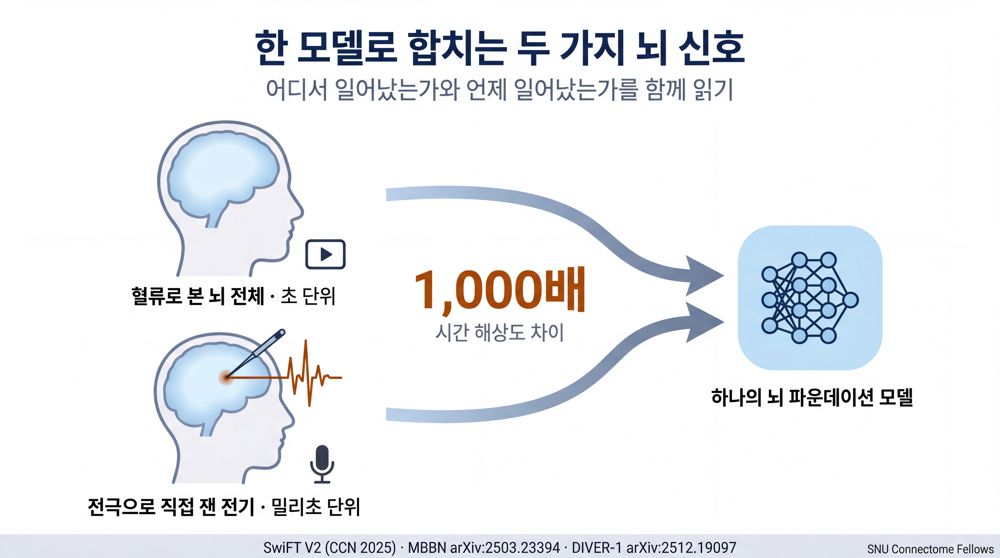
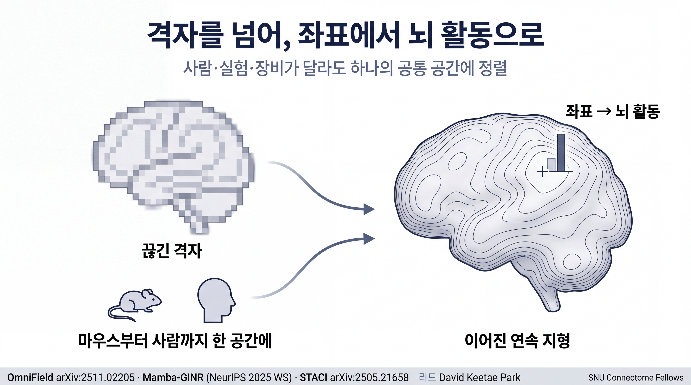
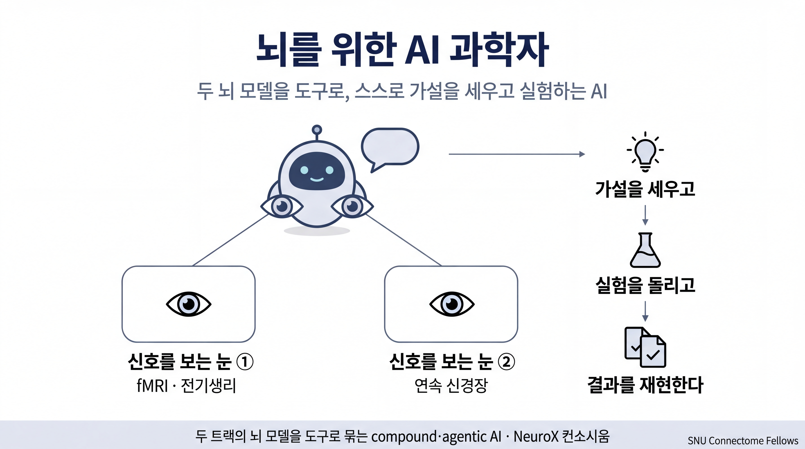
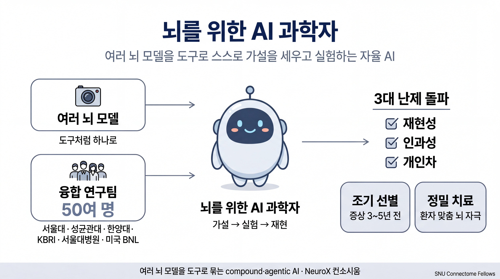

# 함께 하는 연구 — 캠페인 인포그래픽

> SNU Connectome Lab 학부생 펠로우십 모집 광고문(`RECRUITMENT_POSTING_v3_draft.md` §함께 하는 연구)의 핵심 연구 캠페인을 3장의 한국어 인포그래픽(16:9)으로 시각화한 자료입니다.
> 출처 사실은 광고문 본문과 `LAB_PAPERS.md`에 근거하며, 이미지 안 수치는 화이트리스트(1,000배 · CCN 2025 · arXiv 번호)만 사용했습니다.

---

## ① Brain Foundation Model — fMRI + 전기생리(ephys) 병합

**트랙 ① Brain Foundation Model** — 혈류로 본 뇌 전체('비디오', 초 단위)와 전극으로 직접 잰 전기('마이크', 밀리초 단위)는 시간 해상도가 **1,000배** 넘게 차이 납니다. 이 둘을 하나의 뇌 파운데이션 모델로 합쳐 '뇌의 어디서'와 '언제'를 함께 읽습니다.
*관련 lab 논문: SwiFT V2 (CCN 2025) · MBBN (arXiv:2503.23394) · DIVER-1 (arXiv:2512.19097)*

---

## ② Continuous Neural Field

**트랙 ② Continuous Neural Field** — 격자(grid)를 버리고 *좌표 → 뇌 활동*으로 곧바로 잇는 연속 신경장(neural field)으로, 서로 다른 사람·실험·장비의 뇌 데이터를 하나의 공통 공간에 정렬합니다. (리드: David Keetae Park)
*관련 lab 논문: OmniField (arXiv:2511.02205) · Mamba-GINR (NeurIPS 2025 Workshop) · STACI (arXiv:2505.21658)*

---

## ③ 통합 비전 — AI Scientist for Brain

**통합 비전 (AI Scientist for Brain)** — 두 트랙의 Brain Foundation Model은 뇌 신호를 읽는 *눈*이 되고, 이를 도구처럼 꺼내 쓰는 LLM 에이전트가 가설 → 실험 → 재현을 스스로 돌립니다. 여러 AI를 묶어 과학을 수행하는 **compound·agentic AI**이며, NeuroX 컨소시움에서 함께 만들고 있습니다.

---

## ④ NeuroX 컨소시움 — AI Scientist for Brain

**NeuroX 컨소시움 (AI Scientist for Brain)** — 여러 종류의 Brain Foundation Model을 도구처럼 하나로 묶어, 스스로 가설 → 실험 → 재현(논문)을 수행하는 자율 **뇌과학 AI 과학자**를 만드는 것이 목표입니다. 서울대학교(차지욱 교수 총괄)를 중심으로 성균관대 · 한양대 · 한국뇌연구원(KBRI) · 서울대병원 + 미국 브룩헤이븐 국립연구소(BNL)의 **50여 명** 융합팀이, 뇌 연구의 3대 난제인 **재현성 · 인과성 · 개인차**를 함께 돌파합니다. 그 결과 ADHD·자폐·치매를 증상 **3~5년 전** 조기 선별하고, 우울증 등 환자에게 맞춘 정밀 뇌 자극 치료가 가능해집니다.

---

### 생성 메타데이터
- **모델**: nanobanana2 (Gemini Flash Image Preview, `gemini-3.1-flash-image-preview`), 4K 16:9, thinking HIGH
- **테마**: snu_neurox (SNU Blue #003380 · Signal Orange #E69F00 · Neural Teal #0072B2 · Okabe-Ito 색맹 안전 팔레트)
- **스타일**: visual-first (개념을 다이어그램·메타포로 인코딩, 텍스트 카드 지양)
- **프롬프트 원본**: `assets/prompts_v2/T1_brainfm_prompt.md` · `T2_neuralfield_prompt.md` · `T3_aiscientist_prompt.md` · `T4_neurox_consortium_prompt.md`
