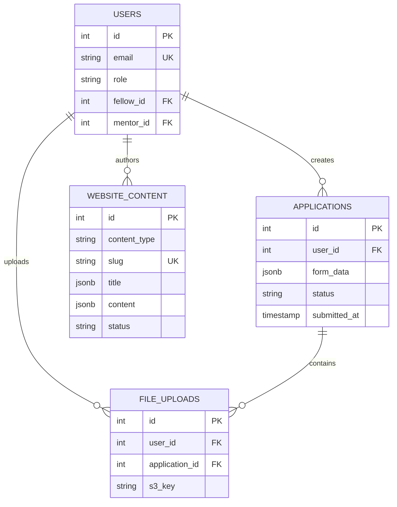

# 🏗️ System Architecture Specification

## 📋 Document Information

**Created**: December 2, 2025
**Author**: Claude AI Research Assistant
**Purpose**: Complete system architecture for SNU Connectome Fellows Program website
**Version**: 1.0

---

## 🎯 Architecture Overview

### System Goals
- **Scalability**: Support growth from 1 to 10+ fellows
- **Performance**: < 2 seconds page load time
- **Security**: WCAG 2.1 AA compliance + GDPR
- **Integration**: Seamless connection with existing systems
- **Maintainability**: Modern, well-documented codebase

### High-Level Architecture

```
┌─────────────────────────────────────────────────────────────┐
│                     Client Layer                            │
├─────────────────────────────────────────────────────────────┤
│  [Web Browser]    [Mobile App]    [Admin Panel]            │
│   React/Next.js   PWA            Management UI             │
│                                                              │
├─────────────────────────────────────────────────────────────┤
│                    CDN & Edge Layer                         │
├─────────────────────────────────────────────────────────────┤
│  [CloudFront]     [WAF]           [Load Balancer]          │
│   Static Assets   Security        Traffic Distribution     │
│                                                              │
├─────────────────────────────────────────────────────────────┤
│                   Application Layer                         │
├─────────────────────────────────────────────────────────────┤
│  [Next.js App]    [FastAPI]      [Streamlit Dashboard]     │
│   Frontend        REST/GraphQL    Existing Dashboard       │
│                                                              │
├─────────────────────────────────────────────────────────────┤
│                   Business Logic Layer                     │
├─────────────────────────────────────────────────────────────┤
│  [Fellow Mgmt]    [AI Services]   [Content Mgmt]           │
│   Existing Code   Multi-LLM       CMS Integration          │
│                                                              │
├─────────────────────────────────────────────────────────────┤
│                    Data Layer                               │
├─────────────────────────────────────────────────────────────┤
│  [PostgreSQL]     [Redis]        [S3 Storage]              │
│   Primary DB      Cache/Session  File Storage              │
│                                                              │
└─────────────────────────────────────────────────────────────┘
```

---

## 🔧 Component Architecture

### Frontend Architecture (Next.js 14)

```typescript
// App Router Structure
app/
├── globals.css                    // Global styles
├── layout.tsx                     // Root layout
├── page.tsx                       // Home page
├── (auth)/                        // Auth group
│   ├── login/page.tsx
│   └── register/page.tsx
├── (public)/                      // Public pages
│   ├── about/
│   │   ├── page.tsx              // Program overview
│   │   ├── curriculum/page.tsx   // Curriculum details
│   │   ├── mentors/page.tsx      // Mentor network
│   │   └── budget/page.tsx       // Investment details
│   ├── research/
│   │   ├── page.tsx              // Research direction
│   │   ├── projects/page.tsx     // Active projects
│   │   └── publications/page.tsx // Publications
│   └── news/
│       ├── page.tsx              // News list
│       └── [slug]/page.tsx       // News detail
├── (application)/                 // Application system
│   ├── apply/page.tsx
│   ├── status/page.tsx
│   └── form/page.tsx
├── (dashboard)/                   // User dashboards
│   ├── fellow/page.tsx
│   ├── mentor/page.tsx
│   └── admin/page.tsx
└── api/                          // API routes
    ├── auth/[...nextauth].ts
    ├── applications/route.ts
    └── ai/chat/route.ts

// Component Architecture
components/
├── ui/                           // shadcn/ui base components
│   ├── button.tsx
│   ├── form.tsx
│   ├── dialog.tsx
│   └── ...
├── layout/
│   ├── Header.tsx
│   ├── Footer.tsx
│   ├── Navigation.tsx
│   └── Sidebar.tsx
├── forms/
│   ├── ApplicationForm.tsx
│   ├── ContactForm.tsx
│   └── AuthForm.tsx
├── charts/
│   ├── BudgetChart.tsx
│   ├── ProgressChart.tsx
│   └── NetworkGraph.tsx
├── program/
│   ├── MentorCard.tsx
│   ├── CurriculumTimeline.tsx
│   ├── BudgetBreakdown.tsx
│   └── AlumniShowcase.tsx
└── ai/
    ├── ChatBot.tsx
    ├── TranslationToggle.tsx
    └── SmartSearch.tsx
```

### Backend Architecture (FastAPI)

```python
# API Structure
api/
├── main.py                       # FastAPI app initialization
├── config/
│   ├── settings.py              # Configuration management
│   └── database.py              # Database connection
├── models/
│   ├── user.py                  # User models
│   ├── application.py           # Application models
│   └── content.py               # Content models
├── schemas/
│   ├── user.py                  # Pydantic schemas
│   ├── application.py
│   └── content.py
├── routers/
│   ├── auth.py                  # Authentication endpoints
│   ├── applications.py          # Application CRUD
│   ├── content.py               # Content management
│   ├── ai.py                    # AI service endpoints
│   └── admin.py                 # Admin operations
├── services/
│   ├── auth_service.py          # Authentication logic
│   ├── ai_service.py            # AI integration
│   ├── existing_adapter.py      # Legacy system adapter
│   └── notification_service.py  # Email/notifications
├── middleware/
│   ├── auth.py                  # JWT middleware
│   ├── cors.py                  # CORS configuration
│   └── security.py              # Security headers
└── utils/
    ├── encryption.py            # Data encryption
    ├── validation.py            # Input validation
    └── helpers.py               # Common utilities
```

### Integration Architecture

```python
# Existing System Integration
class ExistingSystemAdapter:
    """Adapter pattern for legacy system integration"""

    def __init__(self):
        # Import existing modules
        from src.core.fellow.manager import FellowManager
        from src.core.mentor.matcher import MentorMatcher
        from src.ai.llm.client import MultiModelClient

        self.fellow_manager = FellowManager()
        self.mentor_matcher = MentorMatcher()
        self.ai_client = MultiModelClient()

    async def sync_fellow_data(self) -> List[FellowProfile]:
        """Sync fellow data from existing system"""
        fellows = await self.fellow_manager.get_all_fellows()
        return [self._transform_fellow(f) for f in fellows]

    async def get_mentor_network(self) -> NetworkData:
        """Get mentor network visualization data"""
        mentors = await self.mentor_matcher.get_all_mentors()
        relationships = await self.mentor_matcher.get_relationships()
        return self._build_network_graph(mentors, relationships)

    async def ai_chat(self, message: str, context: str) -> str:
        """Handle AI chat using existing LLM client"""
        response = await self.ai_client.chat_completion(
            provider="anthropic",
            model="claude-sonnet-4",
            messages=[{"role": "user", "content": message}],
            context=context
        )
        return response.content
```

---

## 🗄️ Database Architecture

### Schema Design

```sql
-- Core website tables
CREATE TABLE users (
    id SERIAL PRIMARY KEY,
    email VARCHAR(255) UNIQUE NOT NULL,
    password_hash VARCHAR(255),
    first_name VARCHAR(100),
    last_name VARCHAR(100),
    role user_role NOT NULL DEFAULT 'visitor',
    fellow_id INTEGER REFERENCES fellows(id),
    mentor_id INTEGER REFERENCES mentors(id),
    email_verified BOOLEAN DEFAULT false,
    created_at TIMESTAMP DEFAULT CURRENT_TIMESTAMP,
    updated_at TIMESTAMP DEFAULT CURRENT_TIMESTAMP
);

CREATE TYPE user_role AS ENUM (
    'super_admin', 'admin', 'program_manager',
    'mentor', 'fellow', 'applicant', 'visitor'
);

-- Content management
CREATE TABLE website_content (
    id SERIAL PRIMARY KEY,
    content_type content_type NOT NULL,
    slug VARCHAR(255) UNIQUE NOT NULL,
    title JSONB NOT NULL,              -- Multi-language
    content JSONB NOT NULL,            -- Multi-language
    meta_description JSONB,
    featured_image_url VARCHAR(500),
    status content_status DEFAULT 'draft',
    seo_data JSONB,
    created_at TIMESTAMP DEFAULT CURRENT_TIMESTAMP,
    updated_at TIMESTAMP DEFAULT CURRENT_TIMESTAMP,
    created_by INTEGER REFERENCES users(id)
);

CREATE TYPE content_type AS ENUM (
    'page', 'news', 'event', 'blog', 'announcement'
);

CREATE TYPE content_status AS ENUM (
    'draft', 'published', 'archived'
);

-- Application system
CREATE TABLE applications (
    id SERIAL PRIMARY KEY,
    user_id INTEGER REFERENCES users(id),
    form_data JSONB NOT NULL,          -- Complete application data
    status application_status DEFAULT 'draft',
    submitted_at TIMESTAMP,
    reviewed_at TIMESTAMP,
    reviewer_id INTEGER REFERENCES users(id),
    review_notes TEXT,
    score INTEGER CHECK (score >= 0 AND score <= 100),
    created_at TIMESTAMP DEFAULT CURRENT_TIMESTAMP,
    updated_at TIMESTAMP DEFAULT CURRENT_TIMESTAMP
);

CREATE TYPE application_status AS ENUM (
    'draft', 'submitted', 'under_review',
    'accepted', 'rejected', 'waitlisted'
);

-- File management
CREATE TABLE file_uploads (
    id SERIAL PRIMARY KEY,
    user_id INTEGER REFERENCES users(id),
    application_id INTEGER REFERENCES applications(id),
    filename VARCHAR(255) NOT NULL,
    original_name VARCHAR(255) NOT NULL,
    file_size INTEGER NOT NULL,
    mime_type VARCHAR(100) NOT NULL,
    s3_key VARCHAR(500) NOT NULL,
    upload_date TIMESTAMP DEFAULT CURRENT_TIMESTAMP
);

-- Analytics (privacy-compliant)
CREATE TABLE website_analytics (
    id SERIAL PRIMARY KEY,
    session_id VARCHAR(255) NOT NULL,  -- Anonymous session ID
    page_url VARCHAR(500),
    event_type analytics_event NOT NULL,
    event_data JSONB,
    referrer VARCHAR(500),
    country VARCHAR(2),
    timestamp TIMESTAMP DEFAULT CURRENT_TIMESTAMP
);

CREATE TYPE analytics_event AS ENUM (
    'pageview', 'application_start', 'application_submit',
    'download', 'contact_form', 'ai_chat'
);
```

### Database Relationships



---

## 🚀 Deployment Architecture

### AWS Infrastructure

```yaml
# Infrastructure Components
infrastructure:
  compute:
    frontend:
      service: "AWS Amplify"
      runtime: "Node.js 18"
      build_settings:
        baseDirectory: "website"
        buildCommand: "npm run build"
        outputDirectory: ".next"
      environment_variables:
        NEXT_PUBLIC_API_URL: "${API_URL}"
        NEXTAUTH_URL: "${FRONTEND_URL}"
        NEXTAUTH_SECRET: "${NEXTAUTH_SECRET}"

    backend:
      service: "AWS App Runner"
      runtime: "Python 3.11"
      build_settings:
        commands: |
          pip install -r requirements.txt
          alembic upgrade head
      environment_variables:
        DATABASE_URL: "${RDS_URL}"
        REDIS_URL: "${ELASTICACHE_URL}"
        JWT_SECRET: "${JWT_SECRET}"

    existing_integration:
      service: "EC2 t3.medium"
      runtime: "Python 3.10"
      connection: "VPC Peering"

  storage:
    database:
      service: "RDS PostgreSQL 15"
      instance: "db.t3.micro"
      storage: "20GB GP2"
      backup_retention: "7 days"
      multi_az: false

    cache:
      service: "ElastiCache Redis"
      instance: "cache.t3.micro"
      purpose: "Session storage, API cache"

    files:
      service: "S3"
      buckets:
        static_assets: "connectome-static"
        user_uploads: "connectome-uploads"
        backups: "connectome-backups"

  networking:
    vpc:
      cidr: "10.0.0.0/16"
      public_subnets: ["10.0.1.0/24", "10.0.2.0/24"]
      private_subnets: ["10.0.10.0/24", "10.0.20.0/24"]

    security_groups:
      web:
        ingress: ["80/tcp", "443/tcp"]
        egress: ["all"]

      database:
        ingress: ["5432/tcp from app"]
        egress: ["none"]

  monitoring:
    cloudwatch:
      metrics: ["CPU", "Memory", "Disk", "Network"]
      alarms: ["High CPU", "High Error Rate", "Database Connections"]

    logging:
      application_logs: "CloudWatch Logs"
      access_logs: "S3"
      retention: "30 days"
```

### Container Configuration

```dockerfile
# Frontend Dockerfile
FROM node:18-alpine AS deps
WORKDIR /app
COPY package*.json ./
RUN npm ci --only=production && npm cache clean --force

FROM node:18-alpine AS builder
WORKDIR /app
COPY --from=deps /app/node_modules ./node_modules
COPY . .
RUN npm run build

FROM node:18-alpine AS runner
WORKDIR /app
RUN addgroup -g 1001 -S nodejs && adduser -S nextjs -u 1001
COPY --from=builder --chown=nextjs:nodejs /app/.next ./.next
COPY --from=builder /app/node_modules ./node_modules
COPY --from=builder /app/package.json ./package.json
USER nextjs
EXPOSE 3000
CMD ["npm", "start"]

# Backend Dockerfile
FROM python:3.11-slim AS base
WORKDIR /app
RUN pip install --upgrade pip

FROM base AS dependencies
COPY requirements.txt .
RUN pip install --no-cache-dir -r requirements.txt

FROM dependencies AS runtime
COPY . .
RUN chmod +x ./scripts/start.sh
EXPOSE 8000
CMD ["./scripts/start.sh"]
```

### CI/CD Pipeline

```yaml
# GitHub Actions Workflow
name: Deploy to AWS
on:
  push:
    branches: [main, develop]
  pull_request:
    branches: [main]

jobs:
  test:
    runs-on: ubuntu-latest
    strategy:
      matrix:
        node-version: [18]
        python-version: [3.11]

    steps:
      # Checkout code
      - uses: actions/checkout@v3

      # Frontend tests
      - name: Setup Node.js
        uses: actions/setup-node@v3
        with:
          node-version: ${{ matrix.node-version }}
          cache: 'npm'
          cache-dependency-path: website/package-lock.json

      - name: Install dependencies
        run: npm ci
        working-directory: ./website

      - name: Run linting
        run: npm run lint
        working-directory: ./website

      - name: Run tests
        run: npm test
        working-directory: ./website

      - name: Run E2E tests
        run: npm run test:e2e
        working-directory: ./website

      # Backend tests
      - name: Setup Python
        uses: actions/setup-python@v4
        with:
          python-version: ${{ matrix.python-version }}

      - name: Install Python dependencies
        run: |
          pip install -r requirements.txt
          pip install -r requirements-dev.txt
        working-directory: ./api

      - name: Run Python linting
        run: |
          black --check .
          ruff check .
          mypy .
        working-directory: ./api

      - name: Run Python tests
        run: pytest --cov=. --cov-report=xml
        working-directory: ./api

      # Security scans
      - name: Run security audits
        run: |
          npm audit --audit-level=high
          pip-audit
          bandit -r api/

      # Upload coverage
      - name: Upload coverage
        uses: codecov/codecov-action@v3
        with:
          file: ./api/coverage.xml

  deploy:
    needs: test
    runs-on: ubuntu-latest
    if: github.ref == 'refs/heads/main'

    steps:
      - uses: actions/checkout@v3

      # Configure AWS credentials
      - name: Configure AWS credentials
        uses: aws-actions/configure-aws-credentials@v2
        with:
          aws-access-key-id: ${{ secrets.AWS_ACCESS_KEY_ID }}
          aws-secret-access-key: ${{ secrets.AWS_SECRET_ACCESS_KEY }}
          aws-region: ap-northeast-2

      # Deploy frontend to Amplify
      - name: Deploy frontend
        run: |
          aws amplify start-job \
            --app-id ${{ secrets.AMPLIFY_APP_ID }} \
            --branch-name main \
            --job-type RELEASE

      # Deploy backend to App Runner
      - name: Deploy backend
        run: |
          aws apprunner start-deployment \
            --service-arn ${{ secrets.APP_RUNNER_SERVICE_ARN }}

      # Database migrations
      - name: Run migrations
        run: |
          alembic upgrade head
        env:
          DATABASE_URL: ${{ secrets.DATABASE_URL }}

      # Health checks
      - name: Health check
        run: |
          curl -f ${{ secrets.FRONTEND_URL }}/health
          curl -f ${{ secrets.API_URL }}/health
```

---

## 🔐 Security Architecture

### Authentication & Authorization

```typescript
// NextAuth.js Configuration
import NextAuth, { type NextAuthOptions } from "next-auth"
import CredentialsProvider from "next-auth/providers/credentials"
import GoogleProvider from "next-auth/providers/google"
import { JWT } from "next-auth/jwt"

export const authOptions: NextAuthOptions = {
  providers: [
    // Email/Password authentication
    CredentialsProvider({
      name: "credentials",
      credentials: {
        email: { label: "Email", type: "email" },
        password: { label: "Password", type: "password" }
      },
      async authorize(credentials) {
        if (!credentials?.email || !credentials?.password) return null

        const user = await verifyCredentials({
          email: credentials.email,
          password: credentials.password
        })

        return user ? {
          id: user.id,
          email: user.email,
          name: `${user.first_name} ${user.last_name}`,
          role: user.role,
          fellowId: user.fellow_id,
          mentorId: user.mentor_id
        } : null
      }
    }),

    // Google OAuth (SNU accounts)
    GoogleProvider({
      clientId: process.env.GOOGLE_CLIENT_ID!,
      clientSecret: process.env.GOOGLE_CLIENT_SECRET!,
      authorization: {
        params: {
          hd: "snu.ac.kr"  // Restrict to SNU domain
        }
      }
    })
  ],

  callbacks: {
    async jwt({ token, user }: { token: JWT; user: any }) {
      if (user) {
        token.role = user.role
        token.fellowId = user.fellowId
        token.mentorId = user.mentorId
      }
      return token
    },

    async session({ session, token }: { session: any; token: JWT }) {
      session.user.role = token.role
      session.user.fellowId = token.fellowId
      session.user.mentorId = token.mentorId
      return session
    },

    async redirect({ url, baseUrl }: { url: string; baseUrl: string }) {
      // Redirect to appropriate dashboard based on role
      return url.startsWith(baseUrl) ? url : baseUrl
    }
  },

  pages: {
    signIn: "/auth/signin",
    signUp: "/auth/signup",
    error: "/auth/error"
  },

  session: {
    strategy: "jwt",
    maxAge: 24 * 60 * 60, // 24 hours
  },

  jwt: {
    secret: process.env.NEXTAUTH_SECRET,
  }
}
```

### Role-Based Access Control

```python
# RBAC Implementation
from enum import Enum
from typing import List, Set
from functools import wraps
from fastapi import HTTPException, Depends

class Role(str, Enum):
    SUPER_ADMIN = "super_admin"
    ADMIN = "admin"
    PROGRAM_MANAGER = "program_manager"
    MENTOR = "mentor"
    FELLOW = "fellow"
    APPLICANT = "applicant"
    VISITOR = "visitor"

class Permission(str, Enum):
    # Content management
    CREATE_CONTENT = "create_content"
    EDIT_CONTENT = "edit_content"
    DELETE_CONTENT = "delete_content"
    PUBLISH_CONTENT = "publish_content"

    # Application management
    VIEW_APPLICATIONS = "view_applications"
    REVIEW_APPLICATIONS = "review_applications"
    APPROVE_APPLICATIONS = "approve_applications"

    # User management
    MANAGE_USERS = "manage_users"
    VIEW_USER_PROFILES = "view_user_profiles"
    EDIT_USER_PROFILES = "edit_user_profiles"

    # Analytics and reports
    VIEW_ANALYTICS = "view_analytics"
    EXPORT_DATA = "export_data"

    # AI services
    USE_AI_CHAT = "use_ai_chat"
    ADMIN_AI_SETTINGS = "admin_ai_settings"

# Permission matrix
ROLE_PERMISSIONS: dict[Role, Set[Permission]] = {
    Role.SUPER_ADMIN: set(Permission),  # All permissions

    Role.ADMIN: {
        Permission.CREATE_CONTENT,
        Permission.EDIT_CONTENT,
        Permission.PUBLISH_CONTENT,
        Permission.VIEW_APPLICATIONS,
        Permission.REVIEW_APPLICATIONS,
        Permission.VIEW_ANALYTICS,
        Permission.MANAGE_USERS,
        Permission.USE_AI_CHAT,
    },

    Role.PROGRAM_MANAGER: {
        Permission.CREATE_CONTENT,
        Permission.EDIT_CONTENT,
        Permission.VIEW_APPLICATIONS,
        Permission.REVIEW_APPLICATIONS,
        Permission.VIEW_ANALYTICS,
        Permission.VIEW_USER_PROFILES,
        Permission.USE_AI_CHAT,
    },

    Role.MENTOR: {
        Permission.VIEW_APPLICATIONS,    # Only matched applicants
        Permission.VIEW_USER_PROFILES,   # Only matched fellows
        Permission.USE_AI_CHAT,
    },

    Role.FELLOW: {
        Permission.VIEW_USER_PROFILES,   # Own profile only
        Permission.USE_AI_CHAT,
    },

    Role.APPLICANT: {
        Permission.USE_AI_CHAT,
    },

    Role.VISITOR: set()  # No special permissions
}

def require_permission(permission: Permission):
    """Decorator for endpoint permission checking"""
    def decorator(func):
        @wraps(func)
        async def wrapper(*args, current_user = Depends(get_current_user), **kwargs):
            user_permissions = ROLE_PERMISSIONS.get(current_user.role, set())

            if permission not in user_permissions:
                raise HTTPException(
                    status_code=403,
                    detail=f"Permission {permission} required"
                )

            return await func(*args, current_user=current_user, **kwargs)
        return wrapper
    return decorator

def require_role(*roles: Role):
    """Decorator for role-based access control"""
    def decorator(func):
        @wraps(func)
        async def wrapper(*args, current_user = Depends(get_current_user), **kwargs):
            if current_user.role not in roles:
                raise HTTPException(
                    status_code=403,
                    detail=f"One of roles {roles} required"
                )

            return await func(*args, current_user=current_user, **kwargs)
        return wrapper
    return decorator

# Usage examples
@router.get("/applications")
@require_permission(Permission.VIEW_APPLICATIONS)
async def get_applications(current_user: User):
    # Implementation here
    pass

@router.post("/content")
@require_role(Role.ADMIN, Role.PROGRAM_MANAGER)
async def create_content(content_data: ContentCreate, current_user: User):
    # Implementation here
    pass
```

### Data Protection & Encryption

```python
# Data protection utilities
from cryptography.fernet import Fernet
from cryptography.hazmat.primitives import hashes
from cryptography.hazmat.primitives.kdf.pbkdf2 import PBKDF2HMAC
import base64
import secrets
from typing import Dict, Any

class DataProtection:
    """Data encryption and protection utilities"""

    @staticmethod
    def generate_key() -> bytes:
        """Generate a new encryption key"""
        return Fernet.generate_key()

    @staticmethod
    def encrypt_sensitive_data(data: str, key: bytes) -> str:
        """Encrypt sensitive data"""
        f = Fernet(key)
        encrypted_data = f.encrypt(data.encode())
        return base64.urlsafe_b64encode(encrypted_data).decode()

    @staticmethod
    def decrypt_sensitive_data(encrypted_data: str, key: bytes) -> str:
        """Decrypt sensitive data"""
        f = Fernet(key)
        decoded_data = base64.urlsafe_b64decode(encrypted_data.encode())
        decrypted_data = f.decrypt(decoded_data)
        return decrypted_data.decode()

    @staticmethod
    def anonymize_personal_data(data: Dict[str, Any]) -> Dict[str, Any]:
        """Anonymize personal data for analytics"""
        sensitive_fields = [
            'email', 'phone', 'address', 'ssn',
            'passport', 'student_id', 'name'
        ]

        anonymized = data.copy()
        for field in sensitive_fields:
            if field in anonymized:
                # Replace with hash or remove
                anonymized[field] = hashlib.sha256(
                    str(anonymized[field]).encode()
                ).hexdigest()[:8]

        return anonymized

    @staticmethod
    def generate_secure_token() -> str:
        """Generate a secure random token"""
        return secrets.token_urlsafe(32)

    @staticmethod
    def hash_password(password: str, salt: bytes = None) -> tuple[str, bytes]:
        """Hash password with salt"""
        if salt is None:
            salt = secrets.token_bytes(32)

        kdf = PBKDF2HMAC(
            algorithm=hashes.SHA256(),
            length=32,
            salt=salt,
            iterations=100000,
        )

        key = base64.urlsafe_b64encode(kdf.derive(password.encode()))
        return key.decode(), salt

    @staticmethod
    def verify_password(password: str, hashed: str, salt: bytes) -> bool:
        """Verify password against hash"""
        try:
            kdf = PBKDF2HMAC(
                algorithm=hashes.SHA256(),
                length=32,
                salt=salt,
                iterations=100000,
            )
            kdf.verify(password.encode(), base64.urlsafe_b64decode(hashed))
            return True
        except:
            return False

# Security middleware
class SecurityMiddleware:
    """Security middleware for FastAPI"""

    def __init__(self, app):
        self.app = app
        self.rate_limiter = RateLimiter()

    async def __call__(self, scope, receive, send):
        if scope["type"] == "http":
            request = Request(scope, receive)

            # Rate limiting
            if not await self.rate_limiter.is_allowed(request.client.host):
                response = Response(
                    "Too Many Requests",
                    status_code=429
                )
                await response(scope, receive, send)
                return

            # Security headers
            async def send_wrapper(message):
                if message["type"] == "http.response.start":
                    headers = dict(message["headers"])

                    # Security headers
                    security_headers = {
                        b"x-content-type-options": b"nosniff",
                        b"x-frame-options": b"DENY",
                        b"x-xss-protection": b"1; mode=block",
                        b"strict-transport-security": b"max-age=31536000; includeSubDomains",
                        b"content-security-policy": b"default-src 'self'",
                        b"referrer-policy": b"strict-origin-when-cross-origin"
                    }

                    headers.update(security_headers)
                    message["headers"] = list(headers.items())

                await send(message)

        await self.app(scope, receive, send_wrapper)
```

---

## 🔗 API Specification

### REST API Design

```python
# FastAPI router structure
from fastapi import APIRouter, Depends, HTTPException, UploadFile
from fastapi.responses import JSONResponse
from typing import List, Optional
from pydantic import BaseModel
from .auth import get_current_user, require_permission

router = APIRouter(prefix="/api/v1", tags=["main"])

# Health check
@router.get("/health")
async def health_check():
    """System health check"""
    return {"status": "healthy", "timestamp": datetime.utcnow()}

# Authentication endpoints
@router.post("/auth/login")
async def login(credentials: UserCredentials):
    """User authentication"""
    user = await authenticate_user(credentials.email, credentials.password)
    if not user:
        raise HTTPException(status_code=401, detail="Invalid credentials")

    token = create_access_token(data={"sub": user.email, "role": user.role})
    return {"access_token": token, "token_type": "bearer", "user": user}

@router.post("/auth/register")
async def register(user_data: UserCreate):
    """User registration"""
    existing_user = await get_user_by_email(user_data.email)
    if existing_user:
        raise HTTPException(status_code=400, detail="Email already registered")

    user = await create_user(user_data)
    return {"message": "User created successfully", "user_id": user.id}

# Application management
@router.post("/applications", response_model=ApplicationResponse)
@require_permission(Permission.CREATE_APPLICATION)
async def create_application(
    application_data: ApplicationCreate,
    current_user: User = Depends(get_current_user)
):
    """Create new application"""
    application = await create_application_record(application_data, current_user.id)
    return application

@router.get("/applications/{application_id}")
async def get_application(
    application_id: int,
    current_user: User = Depends(get_current_user)
):
    """Get application by ID"""
    application = await get_application_by_id(application_id)

    # Check permission to view this application
    if not can_view_application(current_user, application):
        raise HTTPException(status_code=403, detail="Access denied")

    return application

@router.put("/applications/{application_id}")
async def update_application(
    application_id: int,
    application_data: ApplicationUpdate,
    current_user: User = Depends(get_current_user)
):
    """Update application"""
    application = await get_application_by_id(application_id)

    if application.user_id != current_user.id and not has_admin_role(current_user):
        raise HTTPException(status_code=403, detail="Access denied")

    updated_application = await update_application_record(application_id, application_data)
    return updated_application

@router.post("/applications/{application_id}/submit")
async def submit_application(
    application_id: int,
    current_user: User = Depends(get_current_user)
):
    """Submit application for review"""
    application = await get_application_by_id(application_id)

    if application.user_id != current_user.id:
        raise HTTPException(status_code=403, detail="Access denied")

    if application.status != "draft":
        raise HTTPException(status_code=400, detail="Application already submitted")

    await submit_application_for_review(application_id)
    await send_submission_notification(application)

    return {"message": "Application submitted successfully"}

# File upload
@router.post("/applications/{application_id}/files")
async def upload_file(
    application_id: int,
    file: UploadFile,
    current_user: User = Depends(get_current_user)
):
    """Upload file for application"""
    application = await get_application_by_id(application_id)

    if application.user_id != current_user.id:
        raise HTTPException(status_code=403, detail="Access denied")

    # Validate file
    if file.size > 10 * 1024 * 1024:  # 10MB limit
        raise HTTPException(status_code=400, detail="File too large")

    allowed_types = ["application/pdf", "image/jpeg", "image/png", "text/plain"]
    if file.content_type not in allowed_types:
        raise HTTPException(status_code=400, detail="File type not allowed")

    file_record = await save_uploaded_file(file, application_id, current_user.id)
    return {"file_id": file_record.id, "filename": file_record.filename}

# Content management
@router.get("/content/{slug}")
async def get_content(slug: str, lang: str = "ko"):
    """Get content by slug"""
    content = await get_content_by_slug(slug, lang)
    if not content:
        raise HTTPException(status_code=404, detail="Content not found")

    return content

@router.post("/content")
@require_permission(Permission.CREATE_CONTENT)
async def create_content(
    content_data: ContentCreate,
    current_user: User = Depends(get_current_user)
):
    """Create new content"""
    content = await create_content_record(content_data, current_user.id)
    return content

# AI services
@router.post("/ai/chat")
@require_permission(Permission.USE_AI_CHAT)
async def ai_chat(
    chat_request: ChatRequest,
    current_user: User = Depends(get_current_user)
):
    """AI chatbot interaction"""
    # Context based on user role
    context = get_ai_context(current_user)

    response = await ai_service.chat(
        message=chat_request.message,
        context=context,
        user_id=current_user.id
    )

    return {"response": response, "timestamp": datetime.utcnow()}

@router.post("/ai/translate")
async def translate_content(
    translation_request: TranslationRequest
):
    """Content translation"""
    translated = await ai_service.translate(
        text=translation_request.text,
        from_lang=translation_request.from_lang,
        to_lang=translation_request.to_lang
    )

    return {"translated_text": translated}

# Analytics (privacy-compliant)
@router.post("/analytics/event")
async def track_event(
    event_data: AnalyticsEvent,
    request: Request
):
    """Track analytics event"""
    # Anonymize IP address
    ip_address = request.client.host
    anonymized_ip = anonymize_ip(ip_address)

    await record_analytics_event({
        "event_type": event_data.event_type,
        "page_url": event_data.page_url,
        "session_id": event_data.session_id,
        "anonymized_ip": anonymized_ip,
        "timestamp": datetime.utcnow()
    })

    return {"status": "recorded"}

# Admin endpoints
@router.get("/admin/applications")
@require_permission(Permission.VIEW_APPLICATIONS)
async def list_applications(
    status: Optional[str] = None,
    limit: int = 20,
    offset: int = 0,
    current_user: User = Depends(get_current_user)
):
    """List applications for admin review"""
    applications = await get_applications_list(
        status=status,
        limit=limit,
        offset=offset,
        reviewer=current_user
    )

    return {
        "applications": applications,
        "total": await count_applications(status),
        "limit": limit,
        "offset": offset
    }

@router.put("/admin/applications/{application_id}/review")
@require_permission(Permission.REVIEW_APPLICATIONS)
async def review_application(
    application_id: int,
    review_data: ApplicationReview,
    current_user: User = Depends(get_current_user)
):
    """Review application"""
    await review_application_record(
        application_id=application_id,
        reviewer_id=current_user.id,
        decision=review_data.decision,
        notes=review_data.notes,
        score=review_data.score
    )

    # Send notification to applicant
    application = await get_application_by_id(application_id)
    await send_review_notification(application, review_data.decision)

    return {"message": "Review completed"}
```

### GraphQL Schema

```graphql
# GraphQL Schema Definition
type Query {
  # Content queries
  pages(language: Language, type: ContentType): [Page!]!
  page(slug: String!, language: Language): Page
  news(limit: Int, offset: Int): NewsConnection!

  # Program information
  program: Program!
  mentors: [Mentor!]!
  curriculum: Curriculum!
  budget: BudgetInfo!

  # User-specific queries
  me: User
  myApplications: [Application!]!
  myFiles: [FileUpload!]!

  # Admin queries
  applications(
    status: ApplicationStatus
    limit: Int
    offset: Int
  ): ApplicationConnection! @requirePermission(permission: VIEW_APPLICATIONS)

  analytics(period: DateRange!): Analytics! @requirePermission(permission: VIEW_ANALYTICS)
  users(role: UserRole): [User!]! @requirePermission(permission: MANAGE_USERS)
}

type Mutation {
  # Authentication
  login(email: String!, password: String!): AuthPayload!
  register(input: RegisterInput!): AuthPayload!
  logout: Boolean!

  # Application management
  createApplication(input: ApplicationInput!): Application!
  updateApplication(id: ID!, input: ApplicationInput!): Application!
  submitApplication(id: ID!): Application!
  uploadFile(applicationId: ID!, file: Upload!): FileUpload!

  # Content management
  createPage(input: PageInput!): Page! @requirePermission(permission: CREATE_CONTENT)
  updatePage(id: ID!, input: PageInput!): Page! @requirePermission(permission: EDIT_CONTENT)
  publishPage(id: ID!): Page! @requirePermission(permission: PUBLISH_CONTENT)

  # Admin actions
  reviewApplication(
    id: ID!
    decision: ReviewDecision!
    notes: String
    score: Int
  ): Application! @requirePermission(permission: REVIEW_APPLICATIONS)

  # AI interactions
  chatWithAI(message: String!, context: String): ChatResponse! @requirePermission(permission: USE_AI_CHAT)
  translateText(text: String!, fromLang: String!, toLang: String!): String!
}

type Subscription {
  # Real-time updates
  applicationUpdated(userId: ID!): Application!
  newNotification(userId: ID!): Notification!
  chatMessage(sessionId: String!): ChatMessage!
}

# Type definitions
type User {
  id: ID!
  email: String!
  firstName: String!
  lastName: String!
  role: UserRole!
  fellowId: ID
  mentorId: ID
  emailVerified: Boolean!
  createdAt: DateTime!
}

enum UserRole {
  SUPER_ADMIN
  ADMIN
  PROGRAM_MANAGER
  MENTOR
  FELLOW
  APPLICANT
  VISITOR
}

type Application {
  id: ID!
  user: User!
  formData: JSON!
  status: ApplicationStatus!
  submittedAt: DateTime
  reviewedAt: DateTime
  reviewer: User
  reviewNotes: String
  score: Int
  files: [FileUpload!]!
  createdAt: DateTime!
  updatedAt: DateTime!
}

enum ApplicationStatus {
  DRAFT
  SUBMITTED
  UNDER_REVIEW
  ACCEPTED
  REJECTED
  WAITLISTED
}

type Page {
  id: ID!
  slug: String!
  title: String!
  content: String!
  metaDescription: String
  featuredImage: String
  status: ContentStatus!
  createdAt: DateTime!
  updatedAt: DateTime!
}

type Program {
  overview: String!
  vision: String!
  researchAreas: [ResearchArea!]!
  timeline: Timeline!
  requirements: Requirements!
}

type Mentor {
  id: ID!
  name: String!
  affiliation: String!
  expertise: [String!]!
  email: String!
  bio: String
  imageUrl: String
  fellowCount: Int!
  availableSlots: Int!
}

# Directives for authorization
directive @requirePermission(permission: Permission!) on FIELD_DEFINITION
directive @requireRole(roles: [UserRole!]!) on FIELD_DEFINITION

enum Permission {
  CREATE_CONTENT
  EDIT_CONTENT
  DELETE_CONTENT
  PUBLISH_CONTENT
  VIEW_APPLICATIONS
  REVIEW_APPLICATIONS
  APPROVE_APPLICATIONS
  MANAGE_USERS
  VIEW_USER_PROFILES
  EDIT_USER_PROFILES
  VIEW_ANALYTICS
  EXPORT_DATA
  USE_AI_CHAT
  ADMIN_AI_SETTINGS
}
```

---

This system architecture specification provides a comprehensive foundation for building the SNU Connectome Fellows Program website. The design emphasizes scalability, security, and integration with existing systems while maintaining modern development practices and user experience standards.

**Next Steps:**
1. Set up development environment
2. Initialize projects with chosen tech stack
3. Implement core authentication system
4. Begin database schema implementation
5. Start with MVP frontend components

**Version**: 1.0
**Last Updated**: December 2, 2025
**Next Review**: December 16, 2025